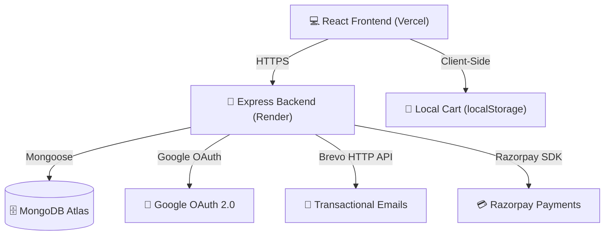

<div align="center">

# 🛒 Cartify

### A Full-Stack E-Commerce Platform — React + Node.js + MongoDB

[](https://react.dev/)
[](https://vitejs.dev/)
[](https://tailwindcss.com/)
[](https://nodejs.org/)
[](https://expressjs.com/)
[](https://mongodb.com/)
[](https://razorpay.com/)
[](https://cartify-hub.vercel.app/)
[](https://cartify-api-10g3.onrender.com/)

🌐 **[Live App](https://cartify-hub.vercel.app/)** · 📘 **[API Docs](#-api-endpoints)** · 🐛 **[Report Bug](https://github.com/surajrajput999/CARTIFY-APP/issues)** · ⭐ **[Star on GitHub](https://github.com/surajrajput999/CARTIFY-APP)**

---

</div>

## 🟢 Project Status

| Status | Phase |
|--------|-------|
| 🟡 Live in Production (Pre-1.0) | Phase 3 — Engineering for Production |

### Sprint Progress

| Sprint | Status |
|--------|--------|
| Sprint 1 | ✅ Complete |
| Sprint 2 | ✅ Complete |
| Sprint 3 | ✅ Complete |
| Sprint 4 | 🚧 Coming Soon |

---

## 📋 Table of Contents

- [🟢 Project Status](#-project-status)
- [📖 About The Project](#-about-the-project)
- [🚀 Latest Improvements](#-latest-improvements)
- [📚 Engineering Documentation](#-engineering-documentation)
- [📸 Screenshots](#-screenshots)
- [✨ Features](#-features)
- [🛠️ Tech Stack](#️-tech-stack)
- [🔒 Security](#-security)
- [⚡ Performance](#-performance)
- [♿ Accessibility](#-accessibility)
- [🚀 Production Readiness](#-production-readiness)
- [🗺 Roadmap](#-roadmap)
- [📁 Monorepo Structure](#-monorepo-structure)
- [⚡ Architecture](#-architecture)
- [🚀 Getting Started](#-getting-started)
- [🔌 API Endpoints](#-api-endpoints)
- [🌍 Deployment](#-deployment)
- [🏆 Current Project Status](#-current-project-status)
- [📬 Contact](#-contact)

---

## 📖 About The Project

**Cartify** is a full-stack e-commerce platform built with React, Node.js, Express, and MongoDB. It implements password, Google OAuth, and OTP-based authentication, Razorpay payments with server-side verification, and is deployed on Vercel (frontend) and Render (backend).

### Key Highlights

- **Secure Authentication** — Multi-method auth: password login, Google OAuth, and OTP-based passwordless login
- **Payment Verification** — Server-side price calculation with HMAC SHA256 signature validation via Razorpay
- **Role-based Authorization** — Admin and user route separation with JWT-protected middleware
- **Performance Optimization** — Lazy-loaded pages and images, responsive layout, and reduced motion support
- **Accessibility** — ARIA labels, keyboard navigation, screen reader support, and accessible forms
- **SEO** — Meta tags, semantic HTML structure, and optimized page load
- **Production Deployment** — Frontend on Vercel, backend on Render, database on MongoDB Atlas

> 🧑‍💻 Built by **Suraj Bhan Pratap Singh** as a portfolio project to demonstrate full-stack development, authentication flows, payment gateway integration, and production deployment on Vercel + Render.

---

## 🚀 Latest Improvements

- **Production-ready architecture** — Clean separation of concerns across pages, hooks, services, and components
- **Route-based code splitting** — Pages loaded on demand with `React.lazy` + `Suspense` for faster initial load
- **Global Error Boundary** — Catches runtime errors and renders a friendly fallback UI
- **Reusable API Service Layer** — All HTTP logic extracted into reusable service modules
- **Shared custom hooks** — Data-fetching and side-effect logic reused across pages
- **Shared reusable UI components** — Consistent, maintainable building blocks
- **Performance optimizations** — Memoization audit and reduced unnecessary re-renders

---

## 📚 Engineering Documentation

Cartify follows a sprint-based engineering process focused on building production-quality software.

| Document | Description |
|----------|-------------|
| [Phase 3 — Engineering for Production](Docs/PHASE-03-ENGINEERING-FOR-PRODUCTION.md) | Engineering approach, architecture decisions, and production standards |
| [Phase 3 Audit](Docs/PHASE-03-AUDIT.md) | Security, performance, and accessibility audit results |
| [Security Notes](Docs/SECURITY.md) | Security hardening decisions and practices |
| [Known Bugs](Docs/BUGS.md) | Confirmed, tracked bugs |
| [Roadmap](Docs/ROADMAP.md) | Planned feature and engineering work |
| [Changelog](Docs/CHANGELOG.md) | Version history |
| [Sprint 1 — Security Foundation](Docs/SPRINT-01-COMPLETE.md) | Completed security hardening and authentication improvements |
| [Sprint 2 — Production Polish & UX](Docs/SPRINT-02-COMPLETE.md) | Completed UX enhancements and production polish |
| [Sprint 3 — Performance & Architecture](Docs/SPRINT-03-COMPLETE.md) | Completed performance and architecture improvements |

---

## 📸 Screenshots

<div align="center">

### 🏠 Home Page — Product Catalog


### 🛍️ Trending Products Grid


</div>

---

## ✨ Features

### 🔐 Authentication (3 Ways)
| Method | Description |
|--------|-------------|
| 📧 **OTP Login** | Passwordless email OTP via Brevo API (Gmail SMTP fallback) — 6-digit code, 10-min expiry |
| 🔑 **Password Auth** | Traditional email/password with bcrypt hashing & JWT |
| 🅶 **Google OAuth** | One-click login with Google account (server-side ID token verification) |

### 🛍️ Shopping Experience
- **Product Catalog** — Grid view with category filter, search, pagination (12/page)
- **Product Details** — Full product page with image, ratings, add-to-cart
- **Shopping Cart** — Add/remove/update quantities, live total, localStorage persistence
- **Checkout** — Address selection, order summary, Razorpay payment flow

### 👤 User Dashboard
- **Profile Management** — Edit name, delete account
- **Order History** — View all past orders with status
- **Address Book** — Full CRUD for delivery addresses

### 🛠️ Admin Panel
- **Product Management** — Add, view, delete, update products
- **Bulk Seed** — Insert 20 sample products in one click
- **Image Upload** — Admin-only image upload via Multer (JPEG/PNG/WebP, max 5MB)
- **Clear Database** — Wipe all products safely

### 💳 Payments
- **Razorpay Integration** — Create orders, verify HMAC SHA256 signatures
- **INR Support** — Indian Rupee payments with test mode

### 🎨 UI/UX
- **Fully Responsive** — Mobile, tablet, desktop
- **Tailwind CSS** — Modern utility-first styling, custom brand colors
- **Lucide Icons** — Clean, consistent iconography
- **Toast Notifications** — Real-time feedback with react-hot-toast

### 🚀 Production Engineering
- **Server-side payment calculation** — All pricing computed server-side to prevent tampering
- **Secure JWT authentication** — Stateless token auth via the Authorization header (Bearer token)
- **Role-based Admin Authorization** — Separate admin routes with middleware protection
- **Helmet security middleware** — HTTP header hardening against common attacks
- **Express Rate Limiting** — Prevents brute-force and abuse
- **Input Validation** — Server-side validation for API inputs
- **Production Error Handling** — Structured error responses with proper status codes
- **Responsive UI** — Mobile-first design across all pages
- **Accessibility Improvements** — ARIA labels, semantic HTML, keyboard navigation
- **SEO Optimization** — Meta tags, semantic structure, fast loading

### 🏗 Engineering Features
- **Helmet** — HTTP header hardening against common web vulnerabilities
- **Rate Limiting** — Prevents brute-force and DDoS abuse on API endpoints
- **Server-side Price Validation** — All pricing computed server-side to prevent tampering
- **JWT Authentication** — Stateless, secure token-based auth (Bearer header, not httpOnly cookies)
- **Google OAuth** — One-click social login with server-side ID token verification
- **OTP Login** — Passwordless email-based authentication
- **Role-based Authorization** — Admin and user route separation with middleware
- **Environment Validation** — Startup checks for required configuration variables
- **Production Error Handling** — Structured error responses with proper status codes
- **Accessibility Improvements** — ARIA labels, semantic HTML, keyboard navigation
- **SEO Improvements** — Meta tags, semantic structure, optimized loading
- **Route-based Code Splitting** — Pages loaded on demand with `React.lazy` + `Suspense`
- **Global Error Boundary** — Catches unexpected runtime errors with a fallback UI
- **Reusable API Service Layer** — Centralized service modules for all HTTP calls
- **Custom Hooks** — Reusable data-fetching and UI logic
- **Memoization Optimization** — `useMemo`/`useCallback` audit to reduce unnecessary re-renders

---

## 🛠️ Tech Stack

| Layer | Technology | Purpose |
|-------|-----------|---------|
| **Frontend** | React 19 + Vite 8 | UI library & build tool |
| **Styling** | Tailwind CSS 4 | Utility-first CSS |
| **Routing** | React Router DOM 7 | Client-side routing |
| **HTTP Client** | Axios 1 (with JWT interceptor) | API calls |
| **Auth** | @react-oauth/google | Google OAuth |
| **Icons** | Lucide React | Icon library |
| **Notifications** | React Hot Toast | Toast alerts |
| **Code Splitting** | React.lazy + Suspense | Route-based lazy page loading |
| **Error Boundary** | React Error Boundary | Global error fallback UI |
| **Custom Hooks** | React Hooks | Reusable data-fetching & UI logic |
| **Service Layer** | Custom API service modules | Centralized, reusable API calls |
| **Backend** | Node.js + Express 4 | REST API server |
| **Database** | MongoDB + Mongoose 9 | NoSQL ODM |
| **Auth** | JWT + bcryptjs | Token auth & password hashing |
| **Payments** | Razorpay SDK | Payment gateway |
| **Email** | Nodemailer + Brevo API | OTP & password reset emails |
| **Uploads** | Multer | File upload handling |
| **Security** | Helmet, CORS, express-rate-limit | HTTP hardening, cross-origin, rate limiting |
| **Validation** | Server-side input validation | Request sanitization & type checking |
| **Frontend Hosting** | Vercel | Edge-deployed frontend |
| **Backend Hosting** | Render | Managed Node.js hosting |
| **Database Hosting** | MongoDB Atlas | Cloud MongoDB |
| **Development** | ESLint, Git, GitHub | Code quality, version control, collaboration |

---

## 🔒 Security

Cartify implements multiple layers of security to protect users and data:

- **JWT Authentication** — Stateless token-based auth with configurable expiry
- **bcrypt Password Hashing** — Salted password storage with configurable rounds
- **Helmet** — HTTP response header hardening against XSS, clickjacking, and other attacks
- **Rate Limiting** — Auth endpoint (5 req/min) and general API (100 req/min) rate limits
- **Server-side Payment Validation** — All pricing computed server-side to prevent client tampering
- **HMAC Razorpay Verification** — SHA256 signature verification for payment authenticity
- **ReDoS Protection** — Regex input sanitization to prevent Regular Expression DoS attacks
- **Role-based Access Control** — Admin and user route separation with middleware guards
- **Environment Validation** — Startup checks ensuring all required config variables are set

---

## ⚡ Performance

- **Lazy Loaded Images** — Images loaded on demand to reduce initial page weight
- **Responsive Layout** — Mobile-first design adapts across all screen sizes
- **Reduced Motion Support** — Respects user `prefers-reduced-motion` settings
- **Optimized Bundle** — Vite-powered build with tree-shaking and code splitting
- **Code Splitting** — Route-based `React.lazy` + `Suspense` loading

---

## ♿ Accessibility

- **ARIA Labels** — Descriptive labels on interactive elements for assistive technologies
- **Keyboard Navigation** — Full keyboard support for all interactive components
- **Accessible Forms** — Properly labeled form inputs with validation feedback
- **Screen Reader Support** — Semantic HTML structure compatible with screen readers
- **Reduced Motion** — Respects user accessibility preferences for reduced animations

---

## 🚀 Production Readiness

| Area | Status |
|------|--------|
| Production Build Passing | ✅ |
| Responsive Design | ✅ |
| Authentication | ⚠️ JWT + OTP work; Google OAuth requires `GOOGLE_CLIENT_ID` set on the backend |
| Authorization | ✅ |
| Payment Integration | ✅ |
| Error Handling | ✅ |
| SEO | ⚠️ robots.txt is not served |
| Accessibility | ⚠️ Known contrast issues |
| Environment Validation | ✅ |
| Secure API | ⚠️ JWT stored in localStorage (XSS-exposed) |

See [Known Bugs](Docs/BUGS.md) for the tracked defect list.

---

## 🗺 Roadmap

### Completed
- Sprint 1 — Security Foundation
- Sprint 2 — Production Polish & UX
- Sprint 3 — Performance & Architecture

### Sprint 4 — Final Optimization & Testing
- Testing Suite
- CI/CD Pipeline
- Monitoring & Logging
- Analytics Integration

---

## 📁 Monorepo Structure

```
CARTIFY-APP/
├── Docs/                    # Engineering documentation
│   ├── PHASE-03-ENGINEERING-FOR-PRODUCTION.md
│   ├── PHASE-03-AUDIT.md
│   ├── SECURITY.md
│   ├── BUGS.md
│   ├── ROADMAP.md
│   ├── CHANGELOG.md
│   ├── SPRINT-01-COMPLETE.md
│   ├── SPRINT-02-COMPLETE.md
│   └── SPRINT-03-COMPLETE.md
│
├── Frontend/                # React + Vite frontend
│   ├── public/
│   ├── screenshots/         # App screenshots
│   ├── src/
│   │   ├── api/             # Axios config & interceptor
│   │   ├── assets/
│   │   ├── components/      # Navbar, HeroBanner, ProductCard, admin/, checkout/, profile/
│   │   ├── context/         # AuthContext, CartContext
│   │   ├── data/            # Seed data
│   │   ├── hooks/           # Reusable data-fetching hooks
│   │   ├── pages/           # 8 pages (Home, Cart, Login, Profile, etc.)
│   │   ├── services/        # API service modules
│   │   ├── utils/           # Shared helper functions
│   │   ├── App.jsx          # Router setup (code-split)
│   │   ├── main.jsx         # Entry point
│   │   └── config.js        # API URL, Razorpay & Google client IDs
│   ├── index.html
│   ├── vite.config.js
│   ├── tailwind.config.js
│   └── vercel.json
│
├── Backend/                 # Node.js + Express backend
│   ├── middleware/          # Auth middleware (JWT protect, admin)
│   ├── models/              # Mongoose schemas
│   ├── routes/              # 6 route files
│   ├── scripts/             # Admin setup script
│   ├── utils/               # Email utility
│   ├── server.js            # Express entry point
│   ├── seedProducts.js      # Product seeder
│   └── .env.example
│
├── .gitignore
└── README.md                # ← You are here
```

---

## ⚡ Architecture



**Production Highlights**

- **JWT Authentication** — Stateless, secure token-based auth
- **Role-based Authorization** — Admin & user route separation
- **Secure Razorpay Verification** — HMAC SHA256 signature validation
- **MongoDB Atlas** — Cloud-hosted, auto-scaled database
- **Production-ready API validation** — Request sanitization and error handling
- **Responsive React UI** — Mobile-first, accessible, and fast
- **Environment validation** — Startup checks for required config

---

## 🚀 Getting Started

### Prerequisites

- Node.js v18+
- npm
- MongoDB Atlas account (or local MongoDB)
- Razorpay test account
- Google Cloud Console project (for OAuth)

### 1️⃣ Clone & Install

```bash
git clone https://github.com/surajrajput999/CARTIFY-APP.git
cd CARTIFY-APP

# Install frontend dependencies
cd Frontend && npm install

# Install backend dependencies
cd ../Backend && npm install
```

### 2️⃣ Configure Backend

```bash
cd Backend
cp .env.example .env   # Fill in your credentials
```

Required environment variables:

| Variable | Description |
|----------|-------------|
| `MONGO_URI` | MongoDB connection string |
| `JWT_SECRET` | Secret key for JWT signing |
| `RAZORPAY_KEY_ID` | Razorpay test key ID |
| `RAZORPAY_KEY_SECRET` | Razorpay test key secret |
| `GOOGLE_CLIENT_ID` | Google OAuth client ID (must match the frontend's `VITE_GOOGLE_CLIENT_ID`) |
| `BREVO_API_KEY` | Brevo transactional email API key |

### 3️⃣ Configure Frontend

```bash
cd Frontend
```

Create `.env`:

```env
VITE_API_URL=http://localhost:5000
VITE_RAZORPAY_KEY=rzp_test_your_key
VITE_GOOGLE_CLIENT_ID=your_google_client_id
```

### 4️⃣ Seed Database (Optional)

```bash
cd Backend
node seedProducts.js
```

### 5️⃣ Run Locally

```bash
# Terminal 1 — Backend (http://localhost:5000)
cd Backend
npm run dev

# Terminal 2 — Frontend (http://localhost:5173)
cd Frontend
npm run dev
```

---

## 🔌 API Endpoints

### Authentication (`/api/auth`)
| Method | Route | Auth | Description |
|--------|-------|------|-------------|
| POST | `/send-otp` | — | Send login OTP to email |
| POST | `/verify-otp` | — | Verify OTP & get JWT |
| POST | `/register` | — | Password signup |
| POST | `/login` | — | Password login |
| POST | `/forgot-password` | — | Send reset OTP |
| POST | `/reset-password` | — | Reset password |
| POST | `/google` | — | Google OAuth login |
| PUT | `/update/:id` | JWT | Update profile |
| DELETE | `/delete/:id` | JWT | Delete account |

### Products (`/api/products`)
| Method | Route | Auth | Description |
|--------|-------|------|-------------|
| GET | `/` | — | List (search, category, page, limit) |
| GET | `/:id` | — | Get by ID |
| POST | `/add` | Admin | Add product |
| POST | `/seed` | Admin | Bulk insert |
| PATCH | `/:id` | Admin | Update product |
| DELETE | `/:id` | Admin | Delete product |
| DELETE | `/clear` | Admin | Clear all |

### Orders (`/api/orders`)
| Method | Route | Auth | Description |
|--------|-------|------|-------------|
| GET | `/myorders/:userId` | JWT | User order history (own orders only) |

> Order records are created server-side during the payment flow (see `/api/payment` below); the client never submits prices, totals, or order status.

### Payments (`/api/payment`)
| Method | Route | Auth | Description |
|--------|-------|------|-------------|
| POST | `/create-order` | JWT | Create Razorpay order (server-computed total, persists a Pending order) |
| POST | `/verify-payment` | JWT | Verify payment signature & finalise the order to Paid |

### Addresses (`/api/addresses`)
| Method | Route | Auth | Description |
|--------|-------|------|-------------|
| POST | `/add` | JWT | Add address |
| GET | `/:userId` | JWT | Get user addresses |
| DELETE | `/:id` | JWT | Delete address |

### Upload (`/api/upload`)
| Method | Route | Auth | Description |
|--------|-------|------|-------------|
| POST | `/` | Admin | Upload product image |

---

## 🌍 Deployment

### Frontend — Vercel

| Detail | Value |
|--------|-------|
| **Live URL** | [https://cartify-hub.vercel.app](https://cartify-hub.vercel.app) |
| **Root Directory** | `Frontend` |
| **Framework Preset** | Vite |
| **Environment Variables** | `VITE_API_URL`, `VITE_RAZORPAY_KEY`, `VITE_GOOGLE_CLIENT_ID` |

### Backend — Render

| Detail | Value |
|--------|-------|
| **Live URL** | [https://cartify-api-10g3.onrender.com](https://cartify-api-10g3.onrender.com) |
| **Root Directory** | `Backend` |
| **Build Command** | `npm install` |
| **Start Command** | `npm start` |

### Production Status

| Component | Status |
|-----------|--------|
| **Frontend** | ✅ Live on Vercel |
| **Backend** | ✅ Live on Render |
| **Database** | ✅ MongoDB Atlas |
| **Payment** | ✅ Razorpay Test Mode |
| **Authentication** | ⚠️ JWT + OTP live; Google OAuth requires `GOOGLE_CLIENT_ID` set on Render |
| **Build** | ✅ Production Build Passing |

---

## 🏆 Current Project Status

| Category | Detail |
|----------|--------|
| **Phase** | Engineering for Production |
| **Current Progress** | ✅ Sprint 1 Complete · ✅ Sprint 2 Complete · ✅ Sprint 3 Complete · 🚧 Sprint 4 Coming Soon |
| **Production Readiness** | ⚠️ Pre-1.0 — known issues tracked in [Docs/BUGS.md](Docs/BUGS.md) |
| **Build Status** | ✅ Passing |

---

## 📬 Contact

**Suraj Bhan Pratap Singh**

[](https://www.linkedin.com/in/suraj-bhan-pratap-singh-891727293/)
[](https://github.com/surajrajput999)
[](mailto:surajdona2005@gmail.com)

---

<div align="center">

### ⭐ If you like this project, give it a star on GitHub! ⭐

Built with ❤️ using React, Node.js, Express, MongoDB, Tailwind CSS and Razorpay.

Designed and developed by Suraj Bhan Pratap Singh.

</div>
